# ReGESA_ASPFWTool

> [!NOTE]
> This program is now in **Pre-Alpha** and released for testing, GLHF.
> 
> The current code quality is poor, it's a disaster.\
> But basic functionality like entry parsing, simple insert/replace/remove/zlib/lzma works
>
> Please report any bugs or issues you encounter.\
> Please provide the firmware image file and the steps to reproduce the bug so that I can trace and patch it.
>

 **ASPFWTool** (ASP Firmware Tool)\
 Aims "legacy" firmware security research (as the new architecture "openSIL" will replace "AGESA", or at least a part of it)\
 and to add "new" processor (AM4, Zen3) support to old (Raven) OEM PCs.


## Overview
**ASPFWTool** is a graphical utility designed to explore UEFI firmware, with a focus on the ASP firmware region.

This tool provides an intuitive GUI for inspecting and manipulating firmware structures,\
allowing security researchers, independent developers or anyone who is not knowing anything about the AMD firmware architecture\
to **Insert**, **Replace**, or **Remove** firmware images from the **ASP firmware directories**/**UEFI FFS** and to **edit the APCB (AGESA PSP Configuration Block)**.

### Hardware basics
The "ASP" (AMD Security Processor), formerly known as the "PSP" (Platform Security Processor) is an ARM microprocessor.

- ASP is embedded inside the processor I/O die, and is responsible for several key functions, including platform Root of Trust, cryptographic accelerator, DDR memory/GMI(infinity fabric) encryption, reset/release the platform and the x86 cores.
- ASP is also responsible for the initialization of all system sub-modules, such as SMN, SMU, PMU, etc...
- ASP runs encrypted, signed, proprietary, undocumented firmware.

## Features

- **Qt Based GUI Firmware Browser**
  - Visualize ASP, UEFI firmware directory structures  
  - Draggable info plane
  - Hex viewer

- **Firmware Editing**
  - View and Edit the EFS
  - Insert new firmware entries, ASP and UEFI region  
  - Replace existing firmware images, ASP FW, UEFI PEI and DXE  
  - Remove firmware entries
  - Editing the PSPSoftFuseChain (TypeId 0x0B)
  - Editing the APCB Token settings^

- **Firmware Reconstruction**
  - Patching UEFI FV/FFS header
  - Reallocate 0xFF padded area for new firmware entries
  - Auto patching ASP Directory header
  - zlib, lzma, automatic decompression and recompression

- **EFS (Embedded Firmware Structure) Editor**  
  - EFS is responsible for configuring early SPI settings and the ASP firmware directory pointer.
  - Legacy: IMC FW, GbE FW, xHCI FW, Prom FW
  - Current: ASP/BHD Directory Table Pointer

- **APCB (AGESA PSP Configuration Block) Editor**
  - View and modify configuration parameters  
  - Export / import APCB binary blobs
  - Currently APCB Token is View Only

- **Promontory Firmware Editor**
  - View the version information
  - Extract, Replace, Remove the firmware


##  GUI Overview

> Click any row to expand its screenshot(s).

<details>
  <summary><strong>Summary Tab</strong> - Overview of firmware image</summary>
  <br>
  <p>The Summary tab shows basic info about the image (ASP, UEFI, Public keys, Promontory, etc.)</p>
  <p>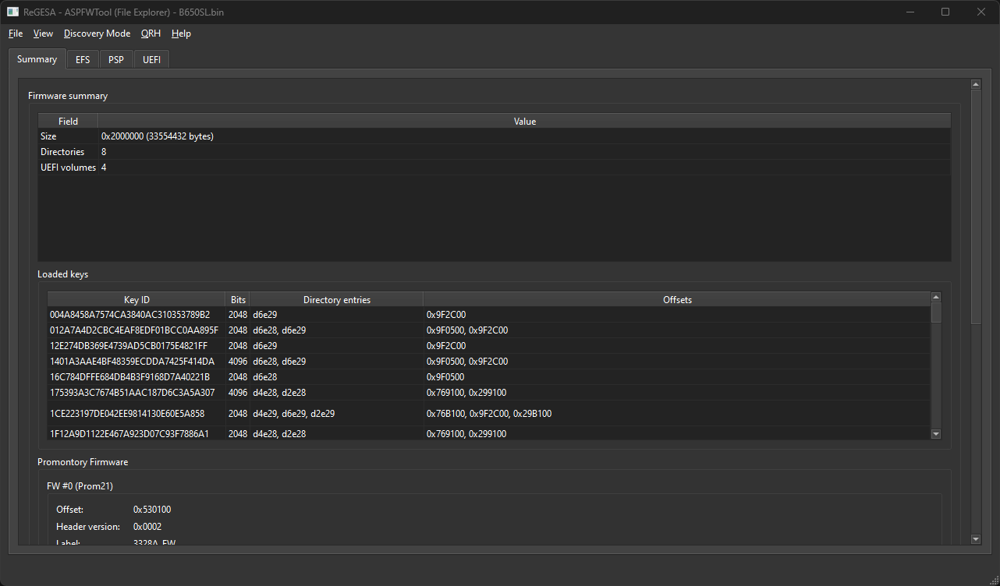</p>
</details>

<details>
  <summary><strong>Promontory Firmware Info</strong> - View and replace the Promontory chipset firmware</summary>
  <br>
  <p>Extract, Replace, or Remove Promontory firmware images, version and metadata shown inline.</p>
  <p>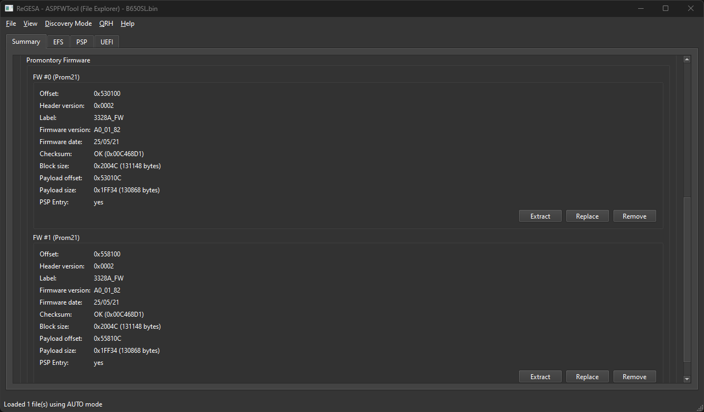</p>
</details>

<details>
  <summary><strong>EFS Editor</strong> - Manage the Embedded Firmware Structure (SPI & pointers)</summary>
  <br>
  <p><em>Edit early SPI settings, legacy firmware address pointer (IMC, GbE, xHCI, Prom), and ASP/BHD directory pointers.</em></p>
  <p>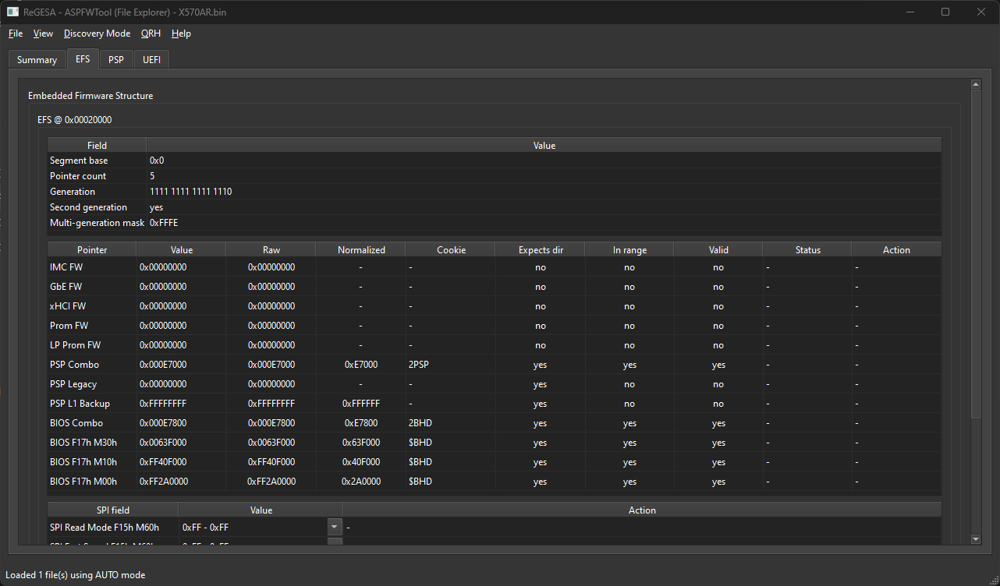</p>
</details>

<details>
  <summary><strong>UEFI Directory View</strong> - Inspect UEFI FV/FFS, PEI/DXE modules</summary>
  <br>
  <p><em>Auto-patching FV/FFS headers, reallocate 0xFF padding, and manage PEI/DXE replacements.</em></p>
  <p>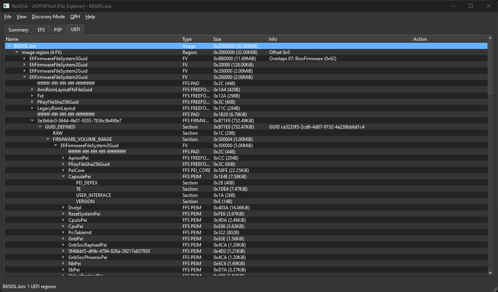</p>
</details>

<details>
  <summary><strong>ASP Directory View</strong> - Hierarchical view of the ASP directory layout, with options to edit the entries.</summary>
  <p><em>Insert / Replace / Remove entries, auto-fix directory headers and recalculate the checksum value.</em></p>
  <p><em>Hierarchical view of the ASP directory</em></p>
  <p>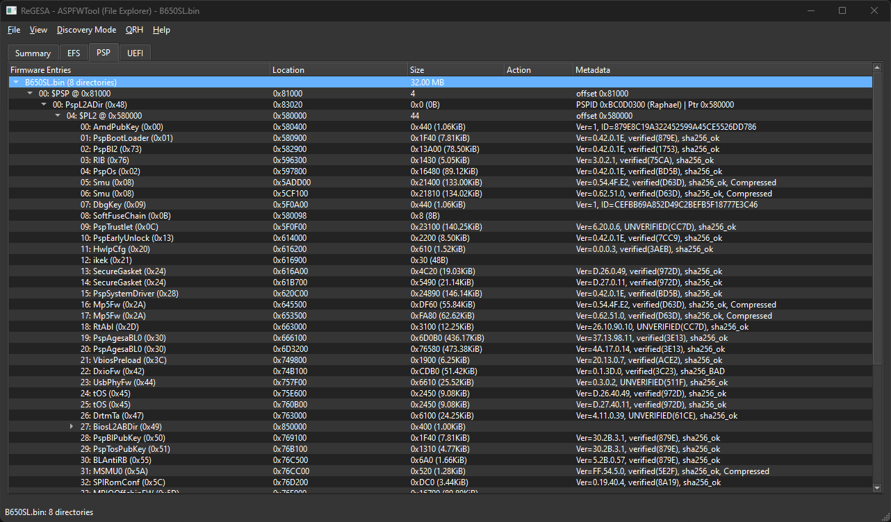</p>
  <p><em>Hierarchical view of the BHD directory, with support for TypeId 0x62, lzma/zlib decompression.</em></p>
  <p>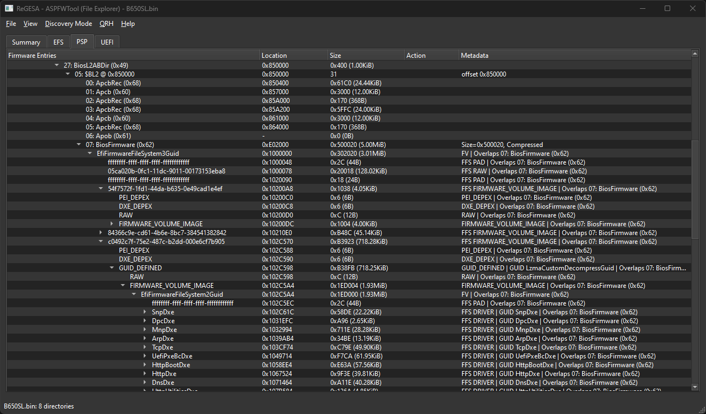</p>
</details>

<details>
  <summary><strong>ASP Directory Edit Panel</strong> - ASP Directory operations</summary>
  <br>
  <p><em>Directory and its entries settings</em></p>
  <p>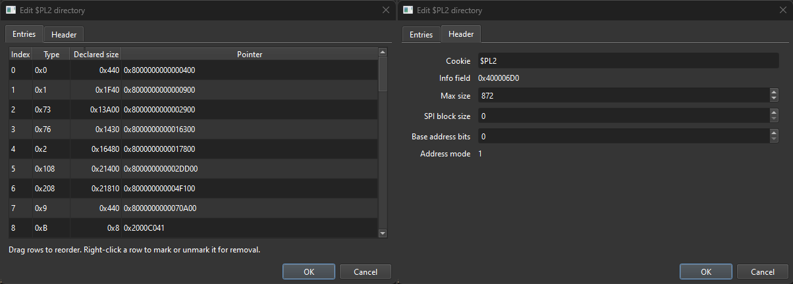</p>
</details>

<details>
  <summary><strong>ASP Entry Edit Panel</strong> - Entry operations (Edit)</summary>
  <br>
  <p><em>Modify existing entry attributes</em></p>
  <p>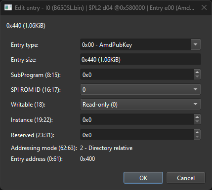</p>
</details>

<details>
  <summary><strong>ASP Entry Replace Panel</strong> - Entry operations (Replace)</summary>
  <br>
  <p><em>Replace existing entry with a new image, and set new attributes</em></p>
  <p>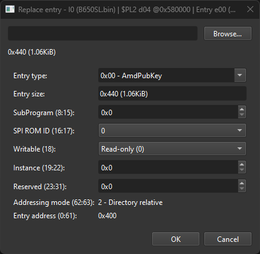</p>
</details>

<details>
  <summary><strong>ASP Entry Insert Panel</strong> - Entry operations (Insert)</summary>
  <br>
  <p><em>Insert a new image entry before a existing entry</em></p>
  <p>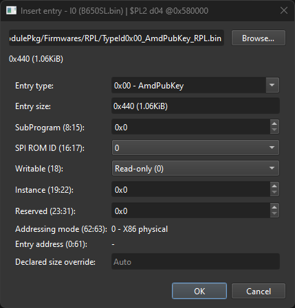</p>
</details>

<details>
  <summary><strong>APCB Panel</strong> - AGESA PSP Configuration Block</summary>
  <p><em>APCB token view panel, Supporting V2 and V3.</em></p>
  <p><em>V3 tokens for new platform.</em></p>
  <p>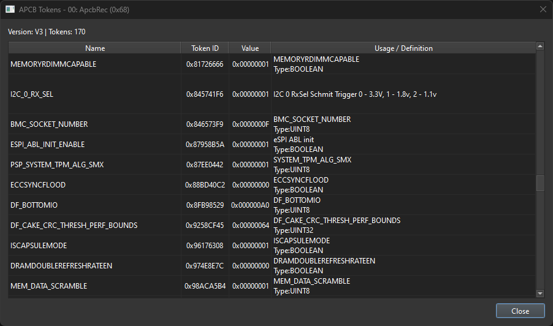</p>
  <p><em>V2 token for legacy platform.</em></p>
  <p>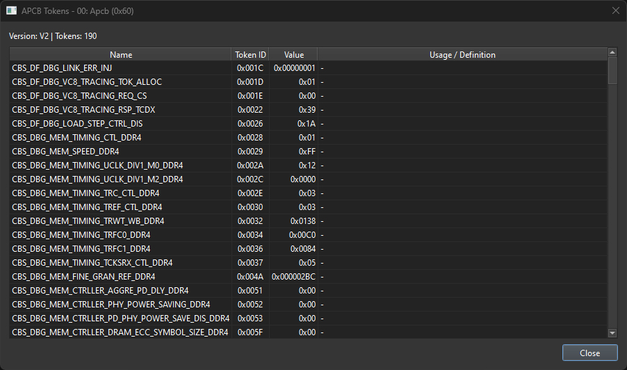</p>
</details>

<details>
  <summary><strong>Soft Fuse Panel</strong> - PSPSoftFuseChain (TypeId 0x0B)</summary>
  <br>
  <p><em>Visualize and edit soft fuse chain values with hints.</em></p>
  <p>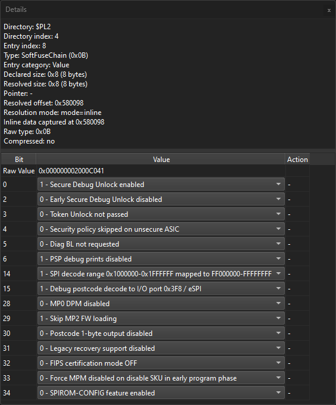</p>
</details>

<details>
  <summary><strong>Public Key Panel</strong> - firmware signing keys (view-only)</summary>
  <br>
  <p><em>Display public keys database (TypeId 0x50, 0x51)</em></p>
  <p>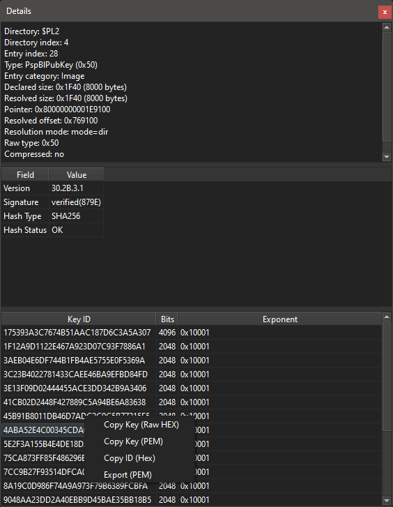</p>
</details>

<details>
  <summary><strong>Microcode Panel</strong> - version information</summary>
  <br>
  <p><em>Read x86 microcode patch version, CPUID and more.</em></p>
  <p>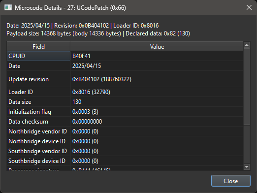</p>
</details>

<details>
  <summary><strong>Hex Viewer</strong> - Hex and ASCII view</summary>
  <br>
  <p><em>a snap-fit (detachable) hex viewer and a pop-up hex viewer (multiple windows OK)</em></p>
  <p>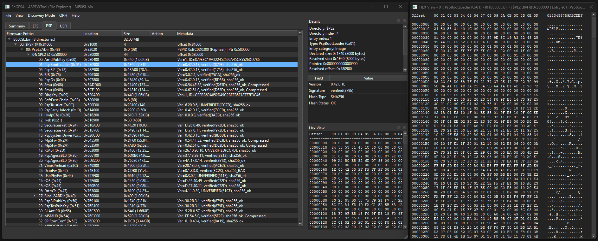</p>
</details>

<details>
  <summary><strong>More Features</strong> - Many more features are under development.</summary>
</details>

---

### Prerequisites
- Python 3.10+, 
- PySide6, 
- Environment with GUI support,
- Dependencies listed in `requirements.txt`

### Build / Run
```bash
git clone https://github.com/ReisWeirdStuff/ReGESA-ASPFWTool.git
cd ReGESA-ASPFWTool
pip install -r requirements.txt
python3 .\run_gui.py
```

---

## License
This project is licensed under the GPLv3 license.\
You can view the full license terms in the LICENSE file.


## Disclaimer
All firmware files, binary code, signatures, trademarks, logos, naming, and proprietary identifiers\
are the exclusive property of their respective legal owners or licensors.


The materials in this repository are provided for informational or experimental use.\
They are not guaranteed to be complete, correct, reliable, functional, or safe to use.

